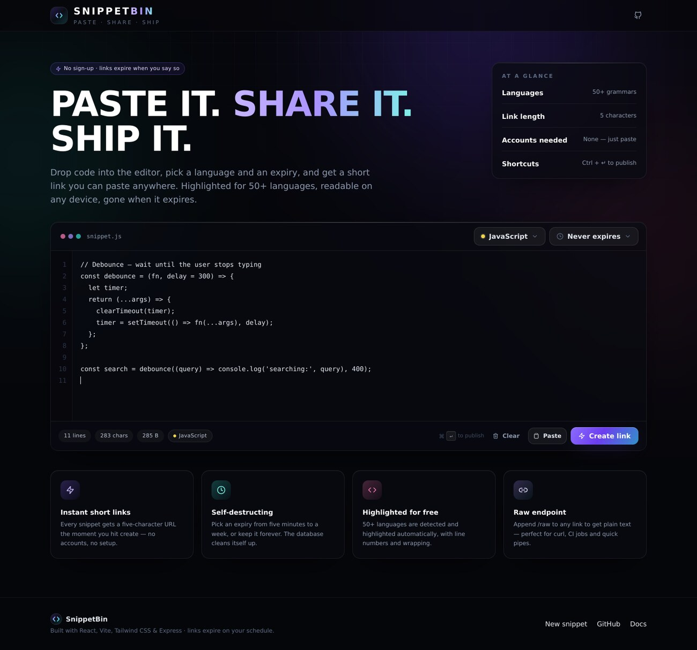
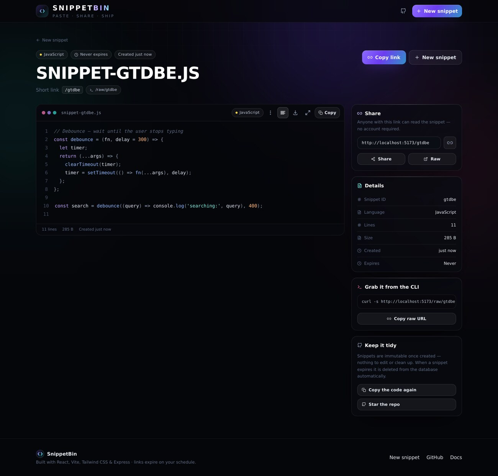
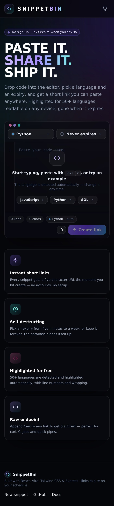

<div align="center">
  
  <h1>SnippetBin</h1>
  <p><strong>Paste it. Share it. Ship it.</strong><br>
  A fast, minimal place to drop code and hand someone a short link.</p>
</div>

<p align="center">
  <a href="#features">Features</a> ·
  <a href="#getting-started">Getting started</a> ·
  <a href="#api">API</a> ·
  <a href="#deployment">Deployment</a>
</p>

<div align="center">
  
  
</div>

## Features

- **Paste & share** — drop code into the editor and get a five-character URL instantly.
- **Auto-detected language** — 50+ grammars with syntax highlighting, line numbers and soft wrapping.
- **Self-destructing links** — 5 minutes to 7 days, or never. MongoDB TTL indexes delete them automatically.
- **Raw endpoint** — `/<code>/raw` returns plain text, ideal for `curl`, CI or piping.
- **Read-only pages** — snippets are immutable; links are safe to hand around.
- **No accounts** — nothing to sign up for, nothing to configure.
- **Keyboard first** — `Tab` indents, `Ctrl/⌘ + Enter` publishes, lettered shortcuts
  for copy, wrap, fullscreen and expiry (`C`, `W`, `F`, `E`).

## Tech stack

| Layer    | Choice                                                   |
| -------- | -------------------------------------------------------- |
| Front end| React 18 + Vite, React Router, Tailwind CSS               |
| Editor   | Custom textarea editor with gutter, Tab indent, ⌘↵ submit |
| Code     | react-syntax-highlighter (Prism), grammars lazy-loaded    |
| API      | Express 4 on Vercel serverless functions                  |
| Storage  | MongoDB + Mongoose (TTL index on `expiresAt`)             |

## Getting started

```bash
git clone https://github.com/LazyShuyaa/SnippetsBin.git
cd SnippetsBin
npm install
```

Create a `.env` in the project root:

```env
PORT=5000
MONGO_URI=your-mongodb-connection-string
```

Install and start the API, then the front end:

```bash
cd api && npm install && npm start   # http://localhost:5000
cd .. && npm run dev                 # http://localhost:5173
```

Vite proxies `/api/*` to `http://localhost:5000`, so no extra CORS setup is
needed during development.

### Demo mode

If the API cannot be reached (backend not started, static preview, database
down), the UI automatically switches to an offline **demo mode**: snippets are
stored in `localStorage`, a badge appears in the header and the footer explains
what is happening. Nothing crashes and the interface stays usable.

## API

| Method | Route                     | Description                                  |
| ------ | ------------------------- | -------------------------------------------- |
| `POST` | `/api/snippets`           | Create a snippet. Body: `{ code, language, expireTime }` (`expireTime` in minutes, `0` or `"never"` = permanent). |
| `GET`  | `/api/snippets/:code`     | Fetch a snippet by its short code.           |
| `GET`  | `/api/health`             | Service + database status.                   |

```bash
curl -X POST http://localhost:5000/api/snippets \
  -H 'Content-Type: application/json' \
  -d '{"code":"print(\"hi\")","language":"python","expireTime":60}'
```

## Deployment

[](https://vercel.com/import/project?template=https://github.com/LazyShuyaa/SnippetsBin)

1. Fork and star the repository.
2. Import the project into Vercel and set `MONGO_URI` as an environment variable.
3. Deploy — `vercel.json` routes `/api/*` to the serverless function and
   everything else to the SPA.

## Project layout

```
api/index.js              Express + Mongoose API
src/App.jsx               Routes and app shell
src/components/           Layout, editor, snippet view, raw view, UI kit
src/components/ui/        Toasts, popovers, language & expiry pickers
src/lib/                  API client, languages, syntax setup, helpers
```
